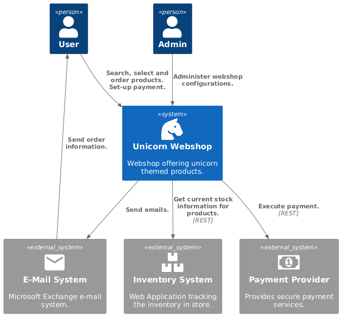

# Documenting and Communicating Software Architecture


## PlantUML in Markdown

### Directly in file
* works nicely in preview in Visual Studio Code (using Markdown Preview Enhanced)
* does **not** work on Github, because Github does not natively support PlantUML
* *should* work on GitLab, because GitLab supports PlantUML (untested)

```plantuml
A -> B: abc
```

### rendering using GitHub Action



## Mermaid in Markdown


