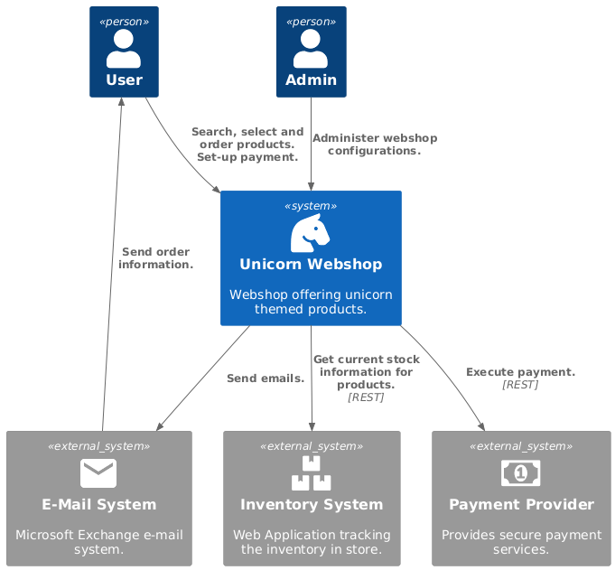

# Unicorn Webshop - Architecture Documentation

## Introduction and Goals
The Unicorn Webshop is a show offering various unicorn themed products. It's main goal is the support of unicorn-lovers by providing the latest and greatest gadgets.

## Constraints

## Context & Scope

The Unicorn Webshop relies on external systems for services such as payment, inventory and sending of emails.

## Solution Strategy

The backend is implemented using microservices.

## Building Block View

## Runtime View

## Deployment View

## Crosscutting Concepts

## Architectural Decisions

## Quality Requirements

## Risk & Technical Debt

## Glossary

